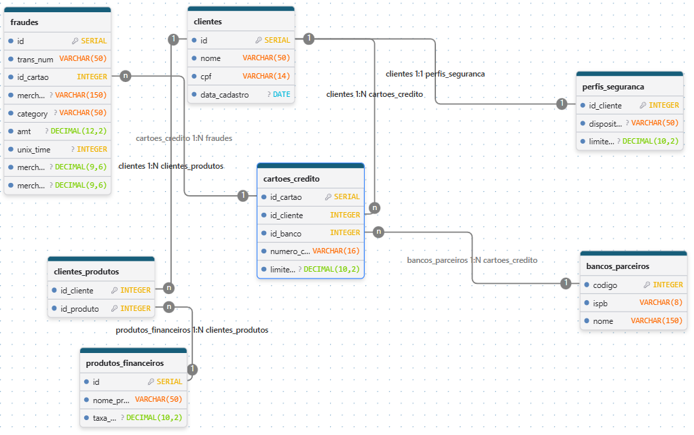

# banco_sj90

Modelo relacional em PostgreSQL com população do banco de dados em Python: `clientes`, `perfis_seguranca`, `cartoes_credito`, `produtos_financeiros`, `clientes_produtos`, `bancos_parceiros` e `fraudes`.

O projeto nasceu como trabalho acadêmico de banco de dados. Esta v2 é uma evolução do modelo para portfólio.

**O que mudou na v2**
- A URI do banco saiu do código e foi para um `.env` (`python-dotenv`).
- `fraudes` agora se liga ao cartão (`id_cartao`), e o cartão ao banco emissor (`id_banco`). Antes, bancos e fraudes ficavam soltos no modelo, ligados pelo código do banco.
- O CSV é lido em blocos (`chunksize=10000`) e só entram transações de cartões existentes.
- Filtro de suspeitas: `amt > 1000` em `shopping_net`, `shopping_pos` e `travel`.

## Dados reais e fictícios

- **Real:** a lista de bancos, vinda da API pública [BrasilAPI](https://brasilapi.com.br/api/banks/v1), que popula `bancos_parceiros`.
- **Fictício:** `clientes`, `perfis_seguranca`, `cartoes_credito`, `produtos_financeiros`, `clientes_produtos`, `fraudes` e o arquivo `fraudes_amostra.csv`.
- **Nenhum resultado diz algo sobre os bancos reais citados, é uma simulação.**
- **A ligação entre cartões e bancos, assim como os números de cartão e as pessoas são inventadas.**

## DER



Cadeia das fraudes: `bancos_parceiros 1:N cartoes_credito 1:N fraudes`.

## Como rodar

Requisitos: Python 3 e um PostgreSQL (local ou gratuito, como o Neon).

```
python -m venv .venv
.venv\Scripts\Activate.ps1
pip install -r requirements.txt
copy .env.example .env
```

Preencha a `DATABASE_URL` no `.env`, mantendo o prefixo `postgresql+psycopg2://`. Depois, da raiz do projeto, execute os arquivos sempre nessa ordem:

```
python src/01_criar_banco.py
python src/02_carregar_bancos_api.py
python src/03_processar_fraudes.py
```

- `01`: recria o schema e as tabelas do zero.
- `02`: carrega os bancos da API em `bancos_parceiros` e insere os dados fictícios.
- `03`: lê o CSV, filtra as possíveis fraudes por cartão, grava em `fraudes` e gera `output/possiveis_fraudes.json`.

## Resultados

Com o filtro `amt > 1000` em uma das categorias "suspeitas" `shopping_net`, `shopping_pos`, `travel`, foram gravadas 60 possíveis fraudes (dados simulados).

**Possíveis fraudes por banco emissor**

| banco | total_fraudes |
|---|---|
| ITAÚ UNIBANCO S.A. | 19 |
| BCO SANTANDER (BRASIL) S.A. | 11 |
| CAIXA ECONOMICA FEDERAL | 11 |
| NU PAGAMENTOS - IP | 8 |
| BANCO INTER | 5 |
| BCO DO BRASIL S.A. | 3 |
| BCO BRADESCO S.A. | 3 |

```sql
SELECT b.nome AS banco, COUNT(*) AS total_fraudes
FROM banco_sj90.fraudes f
JOIN banco_sj90.cartoes_credito c ON c.id_cartao = f.id_cartao
JOIN banco_sj90.bancos_parceiros b ON b.codigo = c.id_banco
GROUP BY b.nome
ORDER BY total_fraudes DESC, b.nome;
```

**Valor médio das fraudes por categoria**

| category | total | valor_medio |
|---|---|---|
| shopping_net | 12 | 5976.28 |
| shopping_pos | 23 | 5256.88 |
| travel | 25 | 4827.38 |

```sql
SELECT category, COUNT(*) AS total, ROUND(AVG(amt), 2) AS valor_medio
FROM banco_sj90.fraudes
GROUP BY category
ORDER BY valor_medio DESC;
```

**Cartões com mais fraudes**

| id_cartao | banco | total_fraudes |
|---|---|---|
| 6 | ITAÚ UNIBANCO S.A. | 8 |
| 5 | CAIXA ECONOMICA FEDERAL | 8 |
| 13 | ITAÚ UNIBANCO S.A. | 7 |
| 8 | BCO SANTANDER (BRASIL) S.A. | 6 |
| 7 | BANCO INTER | 5 |

```sql
SELECT c.id_cartao, b.nome AS banco, COUNT(*) AS total_fraudes
FROM banco_sj90.fraudes f
JOIN banco_sj90.cartoes_credito c ON c.id_cartao = f.id_cartao
JOIN banco_sj90.bancos_parceiros b ON b.codigo = c.id_banco
GROUP BY c.id_cartao, b.nome
ORDER BY total_fraudes DESC, c.id_cartao
LIMIT 5;
```

**Tecnologias:** Python, PostgreSQL, SQL, SQLAlchemy, pandas, requests.